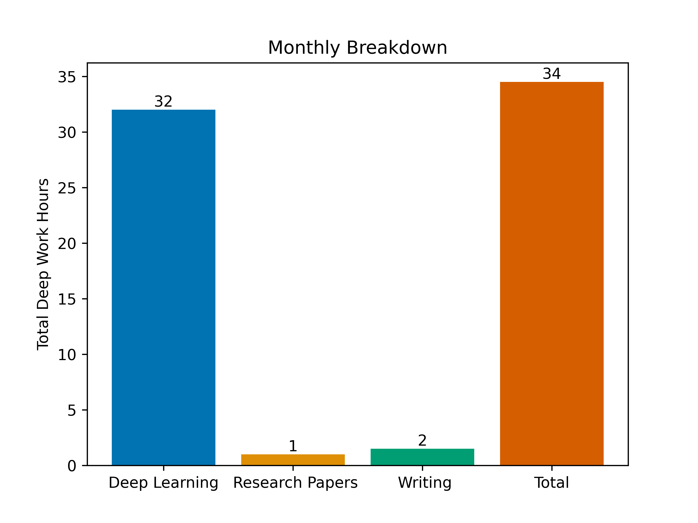
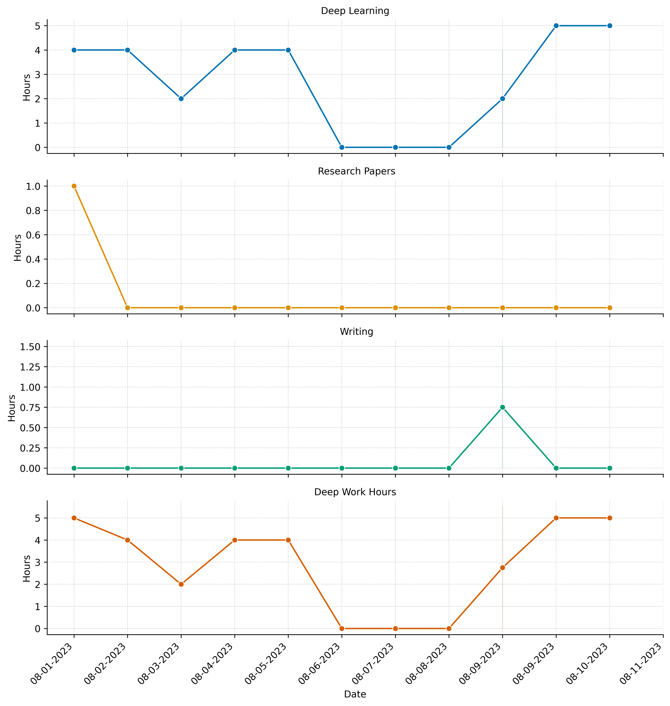
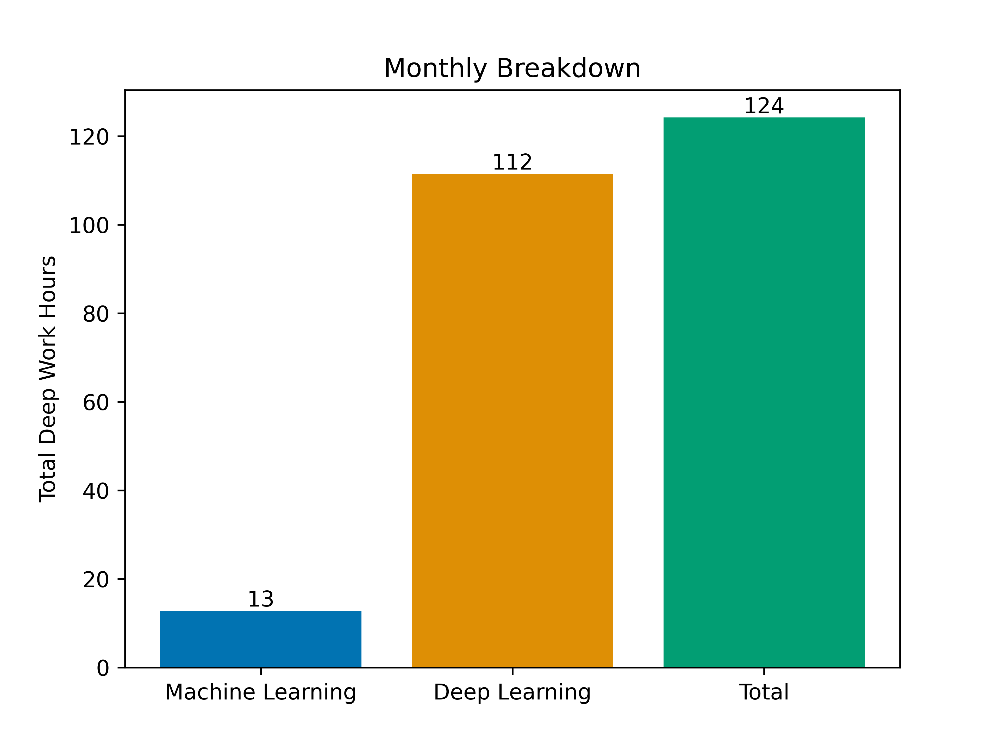

# Deep Work Tracker (Personal)

This is my personal implementation of the Deep Work Tracker. If you'd like to create your own implementation, please see [this](https://github.com/BMCARDONA/deep_work_tracker) repository.
 
Here's my August 2023 deep work breakdown
 ### Monthly Breakdown (July 2023): 
 

 ### Daily Breakdown (July 2023): 

And my July 2023 deep work breakdown: 

 ### Monthly Breakdown (July 2023): 
 

 ### Daily Breakdown (July 2023): 
